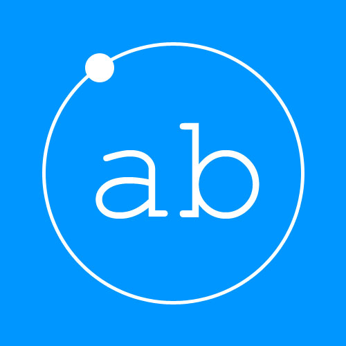

# App Base

A production ready mobile app foundation.

[](https://travis-ci.org/lab-241/appbase)

What's [App Base](https://github.com/lab-241/appbase) ? `AB = LOOPBACK + IONIC`



## Table of content

1. [Features](#features)
1. [Road map](#raod-map)
1. [Getting started](#getting-started)

## Features

* Ready to extend Loopback REST api
* Infinite scroll items list
* Authentication simple form + fb button
* Fitering items basic form
* Manage favorites items list
* Admin dashboard items manager
* Rating and comments items
* Sharing items

## Road map

* Deploy documentation (manual + docker)
* Dev with docker
* Basic ittems filters : type, tags ...
* Dedicated "ionicview" app
* User account managment
* Xamarin based mobile client (ios, android, windows) 
...

## Getting started

Actually, App Base (v1.0) is a fullstack js ecosystem :

* REST API : [LoopBack Framework](https://strongloop.com/node-js/loopback-framework)
* Mobile App : [Ionic Framework](http://ionicframework.com/)
* Dashboard [NG-admin](https://github.com/marmelab/ng-admin)

### Install dev stack

__Prerequites__

* [NodeJs](https://nodejs.org/en/download/package-manager)

__Install dev tools__

App base is built on top of ionic (who use cordova) and strongloop

```
npm install -g cordova ionic strongloop
```

__Start app components__

```
$ git clone git@git.mikangali.com:lab-241/appbase
$ cd appbase

# start loopback api
$ cd api
$ grunt

# start ionic mobile app
$ cd ../mobile
$ ionic serv --lab
```

## ionic app commands

 * cd into project: $ cd appbase/mobile
 * Setup this project to use Sass: ionic setup sass
 * Develop in the browser with live reload: ionic serve
 * Add a platform (ios or Android): ionic platform add ios [android]
 * Build your app: ionic build <PLATFORM>
 * Simulate your app: ionic emulate <PLATFORM>
 * Run your app on a device: ionic run <PLATFORM>
 * Package an app using Ionic package service: ionic package <MODE> <PLATFORM>


## Links

* [Project website](http://appbase.ga)
* [Github repo](https://github.com/lab-241/appbase)
* [slideshow](https://slides.com/mikamboo/app-base/edit)
